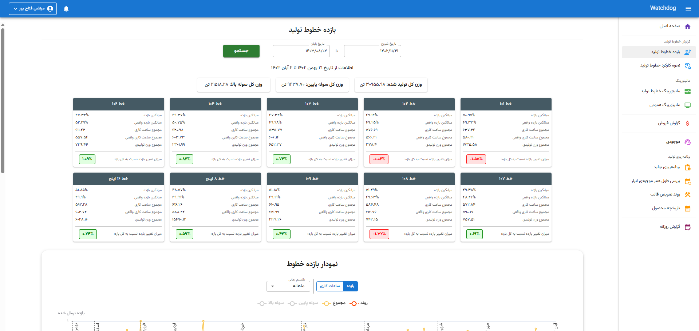
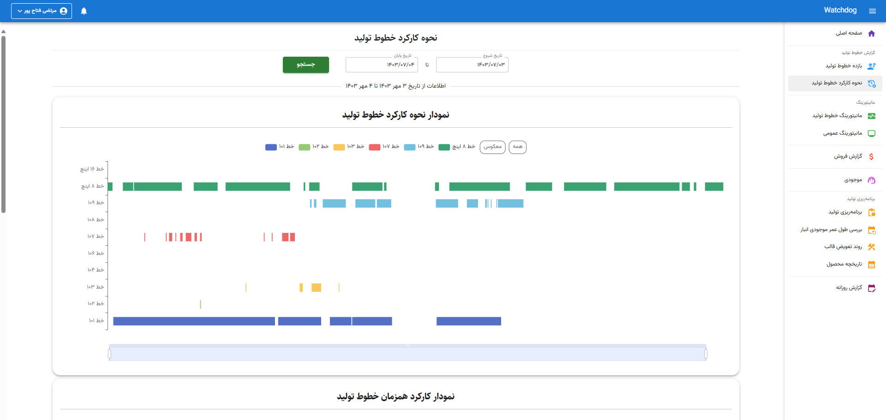
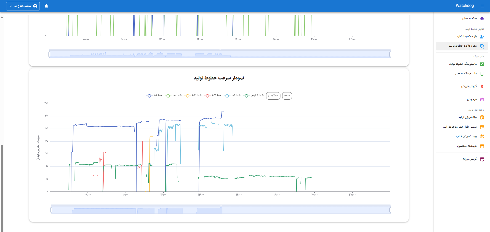
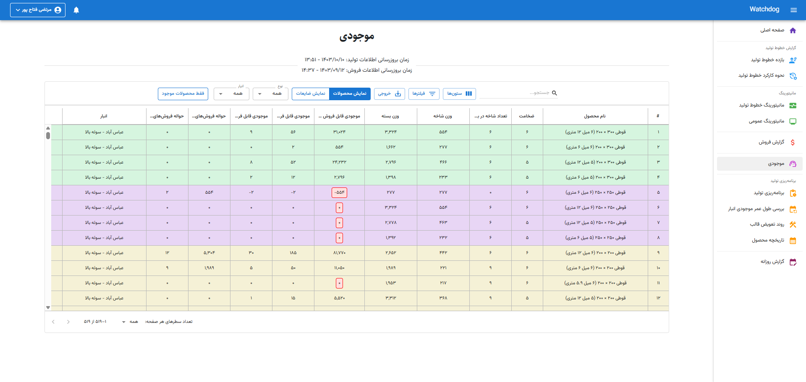
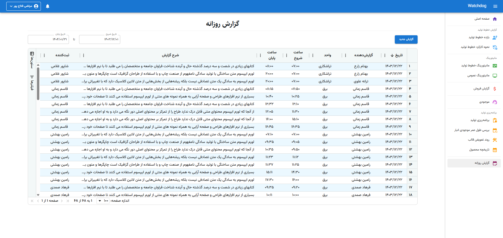
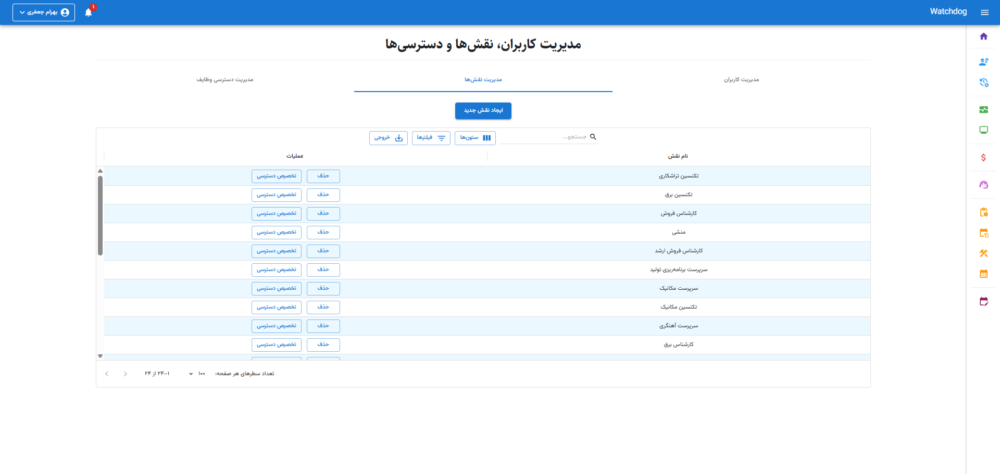
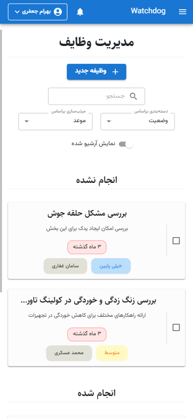
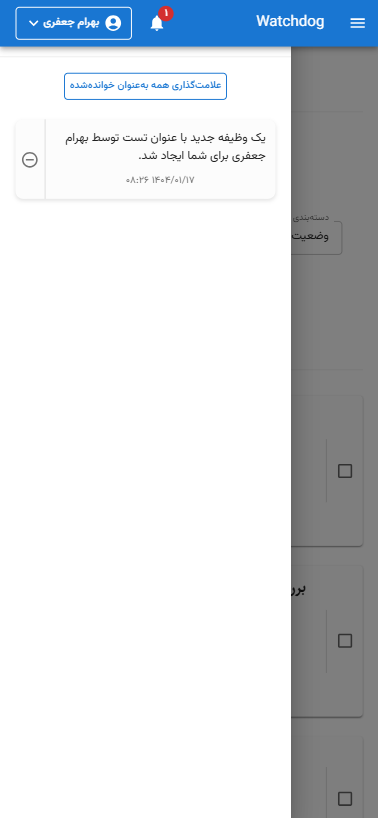

# Watchdog - Pipe Factory Automation System

Watchdog is a comprehensive application designed to automate and streamline operations within a pipe manufacturing factory. Built from scratch using Clean Architecture principles, it provides a robust, scalable, and secure solution for managing production, monitoring systems, user tasks, and more. This private project showcases advanced software engineering practices tailored to industrial automation needs.

## Overview

Watchdog serves as an all-in-one platform for a pipe factory, integrating production line monitoring, task management, daily reporting, and sales/production planning into a unified system. It leverages a permission-based identity system with JWT and refresh tokens, ensuring secure access control across all features. The frontend is built with React and Material-UI (MUI), offering an intuitive user experience, while the backend uses Clean Architecture with ASP.NET Core, Entity Framework Core, and SQL Server for data persistence. Real-time updates are powered by SignalR, and extensive logging is implemented with Serilog for operational transparency.

## Features

- **Identity & Access Management**

  - Secure authentication using JWT with refresh token support.
  - Role-based access control (RBAC) with fine-grained permission management.
  - Dedicated pages for user management, role management, and permission assignment, offering full administrative control.

- **Daily Report System**

  - Users can create and submit daily reports with customizable permissions.
  - Role-specific visibility and editing rights for reports, ensuring data security and relevance.

- **Production Line Monitoring**

  - Real-time tracking of production line performance and status.
  - Monitoring of internal factory applications for uptime and health.
  - Background services handle continuous data collection and processing.

- **Task Management**

  - Comprehensive system for assigning, tracking, and managing tasks across users.
  - Permission-based access to task creation and updates.

- **Sales & Production Planning**

  - Modules for tracking sales information, product stock, and production planning.
  - Insights into production efficiency, work hours, and historical data.

- **Real-Time Notifications**

  - Live notification system built with SignalR, delivering instant updates to users.
  - Alerts for production events, task updates, and system status changes.

- **Logging**

  - Full application-wide logging using Serilog, capturing detailed operational data for debugging and auditing.

- **Responsive Design**
  - Fully responsive on all screen sizes, ensuring seamless usability across desktops, tablets, and mobile devices.

## Technologies Used

- **Backend**

  - ASP.NET Core (Clean Architecture)
  - Entity Framework Core (ORM)
  - SQL Server (Database)
  - SignalR (Real-time communication)
  - Serilog (Logging)
  - JWT Authentication with Refresh Tokens

- **Frontend**
  - React (UI Framework)
  - Material-UI (MUI) (UI Components)
  - MUI DataGrid & AG Grid (Data Tables)
  - ECharts (Charting Library)

## Demo Media

The following screenshots showcase the application's user interface (UI), highlighting its UI features and full responsiveness across various screen sizes. Note that all data displayed in these screenshots is fictional and not representative of real factory data.

https://github.com/user-attachments/assets/4a69ae84-32a7-488b-baaf-5d8b84143e02

https://github.com/user-attachments/assets/271d8e7c-d396-4a8d-ad9c-a7906703392e

https://github.com/user-attachments/assets/c78c5e0e-f6da-4f7e-abc7-9c5ade1b8083

  

  

## Getting Started (Private Repo Note)

As this is a private project, the source code is not available. The repository serves as a showcase of the application's features and architecture for portfolio purposes.

## Authors

- [Morteza Fattah Pour](https://github.com/MortezaFp/)
